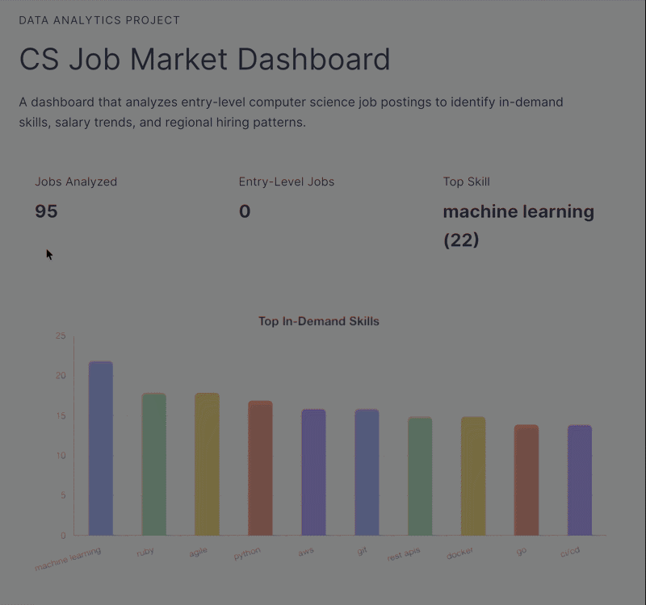
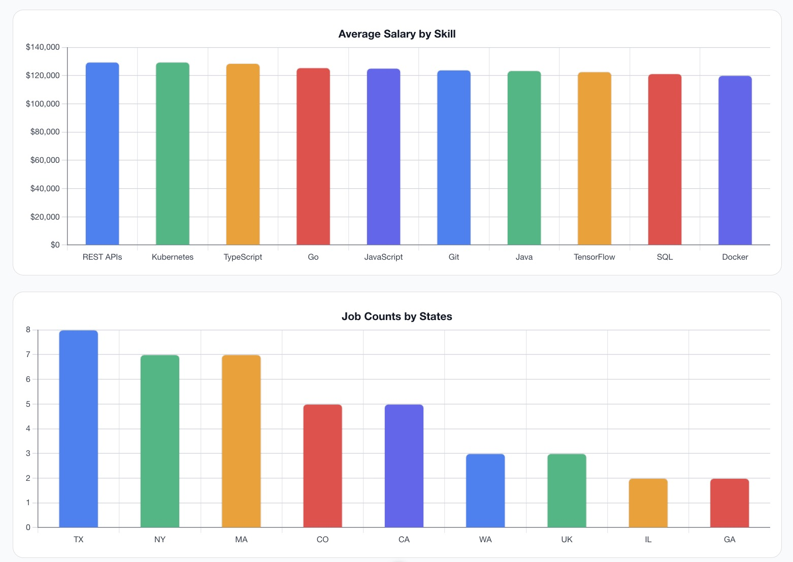

# CS Job Market Dashboard


A full-stack data analytics project that examines entry-level computer science job postings to uncover **in-demand skills, salary trends, and geographic hiring patterns**.

This project combines a **Python data pipeline** with a **Vue.js dashboard** to transform raw job data into clear, interactive insights.

---

## 🌐 Live Demo

👉 https://cs-job-market-dashboard-ayhc.vercel.app/

Deployed using **Vercel**, this live dashboard showcases real-time analysis results including in-demand skills, salary trends, and geographic job distribution.

---

## 🎬 Demo



🎥 Full Demo Video: https://drive.google.com/file/d/1cPrVdEQ-O4DNqQZMvSDfc6ZjU_OAS9tK/view?usp=sharing

---

## 📸 Screenshots

### Dashboard Overview


### Data Visualizations



---

## ⭐ Highlights

- End-to-end data pipeline (cleaning → analysis → visualization)
- Real-world dataset with practical insights
- Full-stack implementation (Python + Vue)
- Structured Git workflow with feature branches

---

## 🚀 Overview

**What this project does:**

* Cleans and processes real-world job market data
* Identifies top technical skills across job postings
* Analyzes average salary by skill
* Visualizes job distribution by location
* Presents results in a modern, interactive dashboard

---

## 🧠 Key Insights (Example Outputs)

* Most in-demand skills (e.g., Python, SQL, JavaScript)
* Higher salaries associated with certain skill combinations
* Regional job distribution trends (e.g., PA, MD, etc.)

---

## 🛠️ Tech Stack

### Backend / Data Pipeline

* Python
* Pandas
* Matplotlib
* CSV / JSON processing

### Frontend

* Vue 3 (Composition API + TypeScript)
* Vue Router
* Chart.js + vue-chartjs
* PapaParse (CSV parsing)

### Tooling & Deployment

- Git / GitHub (feature-branch workflow)
- npm / Node.js
- Virtual environments (Python)
- Vercel (frontend deployment)

---

## 🚀 Deployment

The frontend dashboard is deployed using **Vercel**, enabling fast global delivery and seamless integration with GitHub for continuous deployment.

Any updates pushed to the repository automatically trigger a new deployment.

--- 

## 📁 Project Structure

```
CS-Job-Market-Dashboard/
├── data/                  # Raw and cleaned datasets
├── scripts/               # Python data pipeline
├── output/                # Generated analysis results
├── frontend/              # Vue dashboard app
│   ├── src/
│   └── public/data/       # Data consumed by frontend
├── docs/                  # Project writeups
└── README.md
```

---

## ⚙️ Setup Instructions

### 1. Clone the Repository

```bash
git clone https://github.com/YOUR_USERNAME/CS-Job-Market-Dashboard.git
cd CS-Job-Market-Dashboard
```

---

### 2. Set Up Python Environment

```bash
python3 -m venv .venv
source .venv/bin/activate
pip install pandas matplotlib scikit-learn
```

---

### 3. Add Dataset

Place your dataset in:

```
data/raw_jobs.csv
```

> A Kaggle dataset such as “Tech Jobs, Salaries, and Skills Dataset” is recommended.

---

### 4. Run Data Pipeline

#### Clean the data:

```bash
python scripts/clean_data.py
```

#### Generate analysis outputs:

```bash
python scripts/analyze_data.py
```

This will generate:

```
output/
├── top_skills.csv
├── salary_by_skill.csv
├── jobs_by_state.csv
├── summary.json
├── top_skills.png
└── salary_by_skill.png
```

---

### 5. Move Data to Frontend

```bash
mkdir -p frontend/public/data && cp output/{top_skills.csv,salary_by_skill.csv,jobs_by_state.csv,summary.json} frontend/public/data/
```

---

### 6. Set Up Frontend

```bash
cd frontend
npm install
npm install chart.js vue-chartjs papaparse
```

---

### 7. Run the Dashboard

```bash
npm run dev
```

Open in browser:

```
http://localhost:5173
```

---

## 📊 Dashboard Features

* **Summary Cards**

  * Total jobs analyzed
  * Entry-level jobs count
  * Most in-demand skill

* **Charts**

  * Top Skills (bar chart)
  * Salary by Skill (bar chart)
  * Jobs by State (bar chart)

* **Modern UI**

  * Responsive layout
  * Clean component architecture
  * Data-driven rendering

---

## 📈 Data Pipeline Overview

1. **Data Cleaning**

   * Normalize column names
   * Compute average salary
   * Filter entry-level roles
   * Extract structured fields

2. **Analysis**

   * Skill frequency distribution
   * Salary aggregation by skill
   * Job counts by state

3. **Export**

   * CSV files for charts
   * JSON summary for dashboard

---

## 🔄 Development Workflow

This project uses a professional Git workflow:

* `main` → stable production branch
* `develop` → integration branch
* `feature/*` → isolated feature development

Example:

```
feature/python-data-cleaning
feature/vue-dashboard-visualizations
```

---

## 💼 How to Describe This Project

> Built a full-stack job market analytics dashboard using Python and Vue.js to analyze entry-level software engineering roles, identifying in-demand skills, salary trends, and geographic hiring patterns through a custom data processing pipeline and interactive visualizations.

---

## 🔮 Future Improvements

* Add filtering (by state, skill, job type)
* Integrate live API instead of static CSV
* Add regression model for salary prediction
* Enhance UI/UX with advanced charts

---

## License

This project is open source and available under the **MIT License**.

---


## 👤 Author

Antonio Corona
Computer Science, Millersville University

* Portfolio: https://antonioc-26.github.io/
* GitHub: https://github.com/antonioc-26
* LinkedIn: https://linkedin.com/in/antonioc26

---

## 📌 Context

This project analyzes real-world job market data to provide actionable insights for entry-level software engineering roles.

---
